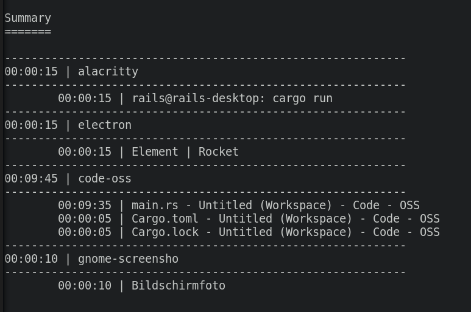

# Work Tracker

Tracks the active window on X11 systems, and cumulates the times and generates a report.

For this to work, [xdotool](https://www.semicomplete.com/projects/xdotool/) needs to be installed.

Inspired by a python Script found on [Ask Ubuntu - Is there software which time- tracks window & application usage?](https://askubuntu.com/a/780542)





## Usage

```
USAGE:
    work_tracker [OPTIONS]

FLAGS:
    -h, --help       Prints help information
    -V, --version    Prints version information

OPTIONS:
    -r, --resolution <SECONDS>    Sets a custom tracking resolution in seconds
```

